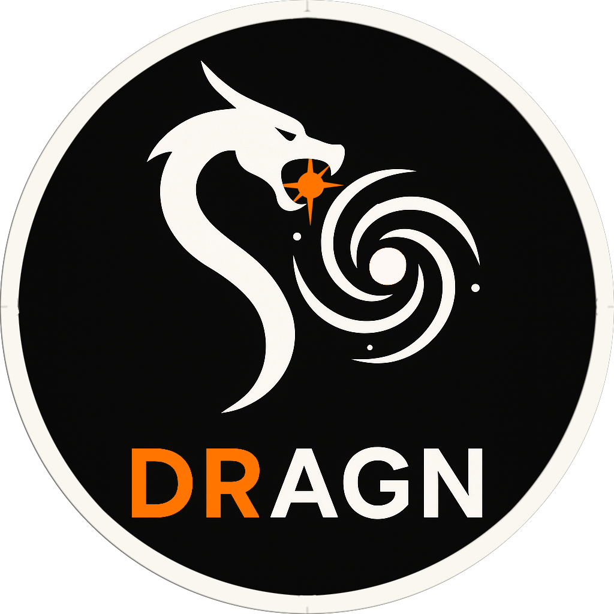

# DRAGN: Deep Removal of AGN



**A Deep Learning approach for AGN
decomposition and substraction from galaxy observations**

---

## Motivation

Active Galactic Nuclei (AGN) are among the brightest and most energetic phenomena in the universe, but their intense luminosity often overwhelms the light from their host galaxies. This makes it difficult to study key galactic features necessary for understanding galaxy evolution and black hole feedback mechanisms. Traditional methods like GALFIT rely on parametric modeling and manual fine-tuning, which are time-consuming, inflexible, and often struggle with irregular or complex morphologies.

DRAGN (Deep Removal of AGN) offers a modern, data-driven alternative. By leveraging deep learning models such as U-Net, Attention U-Net, and cGAN, this project enables automated, scalable, and morphology-agnostic removal of AGN contributions from galaxy images. DRAGN was trained on over 500,000 simulated galaxy-AGN pairs and validated on real JWST/NIRCam observations, showing strong performance in preserving galaxy structure and recovering true photometric properties.

This repository provides the full pipeline—from data preprocessing to model training and evaluation—to empower astronomers with a tool that can handle the increasing data volumes from next-generation surveys like JWST, LSST, and Euclid.

---

## Features

- **Deep Learning AGN Subtraction:** Uses CNNs to remove AGN light from galaxy images.
- **Multiple Architectures:** Includes U-Net, Attention U-Net, and cGAN models.
- **Large-Scale Training:** Trained on over 500,000 simulated galaxy-AGN pairs.
- **JWST/NIRCam F150W Simulation:** Data and models tailored for real astronomical surveys.
- **Modular Pipeline:** Flexible data loading, training, evaluation, and plotting modules.
- **Parallelized Data Processing:** Efficient handling of large datasets with multiprocessing.

---

## Repository Structure

```
.
├── main.py                  # Main entry point for running pipelines
├── requirements.txt         # Python dependencies
├── astro_pipeline/          # Astronomical utilities and photometry
├── data_pipeline/           # Data loading, preprocessing, and analysis
├── examples/                # Example scripts and notebooks 
├── loggers_utils/           # Logging and execution tracking utilities
├── model_testing/           # Model evaluation and plotting
├── model_training/          # Model training scripts
├── networks/                # Neural network architectures and building blocks
├── pipelines/               # High-level pipeline scripts
├── results/                 # Output and results storage
├── utils_utils/             # Miscellaneous utilities
└── ...
```

---

## Installation

1. **Clone the repository:**
    ```bash
    git clone https://github.com/Aureusa/DRAGN
    cd DRAGN
    ```

2. **Install dependencies:**
    ```bash
    pip install -r requirements.txt
    ```

3. **(Optional) Set up a virtual environment:**
    ```bash
    python -m venv .env
    source .env/bin/activate
    ```

---

## Usage

This repository provides a modular framework for AGN subtraction using deep learning. Below is a step-by-step guide to using the library:

### 1. Model Selection or Construction

- **Pre-implemented Models:**  
  Choose from existing models in the `networks/` directory, such as U-Net, Attention U-Net, or cGAN. These models are ready to use and follow a common inheritance structure for compatibility with the training and evaluation modules.

- **Custom Models:**  
  You can build your own model using the building blocks in `networks/blocks/` and `networks/models/`. Ensure your custom model inherits from the base class used by the provided models to maintain compatibility.

### 2. Data Preparation

- **Data Structure:**  
  The `data_pipeline/` module is designed to efficiently handle large astronomical datasets, especially FITS files. It provides wrappers around PyTorch’s `Dataset` and `DataLoader` to enable scalable loading and preprocessing, even for hundreds of thousands of files.

- **Customization:**  
  Review the notes and docstrings in the `data_pipeline/` scripts for details on expected data formats and customization options.

### 3. Model Training & Fine-tuning

- **Training Utilities:**  
  Use the `model_training/` module to streamline model training and fine-tuning. This module provides scripts and utilities for setting up training loops, loss functions, learning rate schedulers, and logging.

- **Example Usage:**  
  Refer to scripts in `model_training/` and high-level pipelines in `pipelines/` for training workflows. The `pipelines/` module contains general-purpose pipelines, but may require further development for advanced use cases.

### 4. Model Evaluation & Plotting

- **Testing & Evaluation:**  
  After training, use the `model_testing/` module for model evaluation, performance analysis, and result visualization. This includes tools for quantitative metrics and plotting outputs.

- **Examples:**  
  See example notebooks and scripts in `examples/` for practical demonstrations of evaluation and plotting.

### 5. Extending the Framework

- **Further Development:**  
  The following modules are functional but may benefit from further development and customization:
  - `astro_pipeline/`
  - `model_training/`
  - `model_testing/`
  - `pipelines/`

  Contributions and improvements are welcome!

---

## License

This project is provided for academic and research purposes. See `LICENSE` for details.

---

## Contact

For questions or contributions, please contact the repository maintainer or open an issue.
