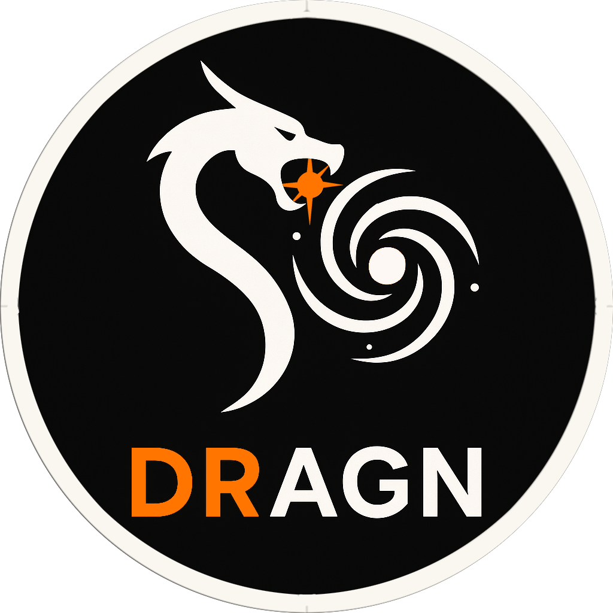

# DRAGN: Deep Removal of AGN



**A modular, configuration-driven deep learning framework for AGN decomposition and subtraction from galaxy observations**

---

## Motivation

Active Galactic Nuclei (AGN) are among the brightest and most energetic phenomena in the universe, but their intense luminosity often overwhelms the light from their host galaxies. This makes it difficult to study key galactic features necessary for understanding galaxy evolution and black hole feedback mechanisms. Traditional methods like GALFIT rely on parametric modeling and manual fine-tuning, which are time-consuming, inflexible, and often struggle with irregular or complex morphologies.

DRAGN (Deep Removal of AGN) offers a modern, data-driven alternative. By leveraging deep learning models such as U-Net, Attention U-Net, and cGAN, this project enables automated, scalable, and morphology-agnostic removal of AGN contributions from galaxy images. DRAGN was trained on over 500,000 simulated galaxy-AGN pairs and validated on real JWST/NIRCam observations, showing strong performance in preserving galaxy structure and recovering true photometric properties.

This framework provides a complete, modular pipeline—from data preprocessing to model training and evaluation—designed to handle the increasing data volumes from next-generation surveys like JWST, LSST, and Euclid.

---

## Key Features

- 🧠 **Multiple Neural Architectures**: U-Net, Attention U-Net, and conditional GAN implementations
- ⚙️ **Configuration-Driven**: Comprehensive YAML-based configuration system with automatic validation
- 🔧 **Modular Design**: Registry pattern for easy extension of models, datasets, losses, and metrics
- 🌌 **Astronomical Focus**: Native FITS file support, astronomical metrics, and domain-specific losses
- 📊 **Advanced Training**: Multiple training strategies, checkpoint management, and comprehensive logging
- 🔍 **Robust Testing**: Multi-model testing capabilities with extensive metric evaluation
- 🚀 **Scalable**: Efficient data loading with multiprocessing support

---

## Repository Structure

```
DRAGN/
├── main.py                     # Configuration file generator
├── train.py                    # Training entry point
├── test.py                     # Single model testing
├── test_multiple_models.py     # Multi-model testing
├── requirements.txt            # Dependencies
│
├── config/                     # Configuration system
│   ├── base.py                # Base configuration classes
│   ├── common.py              # Shared configuration components
│   ├── train_configs.py       # Training configurations
│   ├── test_configs.py        # Testing configurations
│   └── multi_model_test_configs.py
│
├── core/                       # Core framework components
│   ├── component.py           # Base component interface
│   └── registry.py            # Registry system for all components
│
├── networks/                   # Neural network architectures
│   ├── models/                # Model implementations
│   │   ├── _base_model.py     # Base model class
│   │   ├── UNet.py            # U-Net implementation
│   │   ├── attention_unet.py  # Attention U-Net
│   │   ├── patchGAN.py        # Conditional GAN
│   │   └── ...
│   └── blocks/                # Reusable network components
│
├── data/                       # Data handling
│   ├── datasets/              # Dataset implementations
│   ├── loaders/               # Data loaders
│   ├── transforms/            # Data transformations
│   └── utils.py               # Data utilities
│
├── training/                   # Training system
│   ├── trainer.py             # Universal trainer
│   ├── strategies/            # Training strategies
│   ├── loss_functions.py      # Loss function implementations
│   ├── checkpoint_manager.py  # Model checkpointing
│   └── training_logger.py     # Training logging
│
├── testing/                    # Testing and evaluation
│   ├── tester.py              # Single model tester
│   ├── multi_model_tester.py  # Multi-model tester
│   ├── strategies/            # Testing strategies
│   └── metrics.py             # Evaluation metrics
│
├── utils/                      # Utilities
│   ├── building.py            # Component builders
│   ├── device.py              # Device management
│   ├── validation.py          # Input validation
│   └── ...
│
├── astro_pipeline/            # Astronomical utilities
└── results/                   # Training and testing outputs
```

---

## Quick Start

### Installation

1. **Clone the repository:**
   ```bash
   git clone https://github.com/Aureusa/Deep-AGN-Clean.git
   cd DRAGN
   ```

2. **Install dependencies:**
   ```bash
   pip install -r requirements.txt
   ```

3. **Set up a virtual environment (recommended):**
   ```bash
   python -m venv dragn_env
   source dragn_env/bin/activate  # On Windows: dragn_env\Scripts\activate
   pip install -r requirements.txt
   ```

### Basic Usage

#### 1. Generate Configuration Files

DRAGN uses YAML configuration files for all operations. Generate example configurations:

```bash
# Generate example training configuration
python main.py

# This creates example_train_config.yaml, example_test_config.yaml, and example_multi_model_test_config.yaml
```

#### 2. Configure Your Experiment

Edit the generated YAML files to match your data and requirements:

```yaml
# example_train_config.yaml
training_config:
  model_filename: "my_unet_model"
  data_folder: "/path/to/experiment/folder"
  training_strategy: "standard"
  num_epochs: 100

model_settings_config:
  architecture: "unet"
  params:
    in_channels: 1
    out_channels: 1
    features: [32, 32, 64, 128, 256, 32]

train_data_config:
  dataset_type: "galaxy_dataset"
  loader_type: "fits_loader"
  data_path: "/path/to/your/train_data.pkl"
  batch_size: 8

val_data_config:
  dataset_type: "galaxy_dataset"
  loader_type: "fits_loader"
  data_path: "/path/to/your/val_data.pkl"
  batch_size: 8

loss_fn_config:
  loss: "l1_plus_weighted_l2"
  params:
    alpha: 1.0
    beta: 0.2

optimizer_config:
  name: "adam"
  lr: 0.001
  weight_decay: 0.0001
```

#### 3. Train a Model

```bash
python train.py example_train_config.yaml
```

#### 4. Test a Model

```bash
python test.py example_test_config.yaml
```

#### 5. Compare Multiple Models

```bash
python test_multiple_models.py example_multi_model_test_config.yaml
```

---

## Advanced Usage

### Available Components

#### Models
- `unet`: Standard U-Net architecture
- `attention_unet`: U-Net with attention mechanisms  
- `patch_gan`: Conditional GAN for image-to-image translation

#### Loss Functions
- `l1_loss`: L1 (MAE) loss
- `mse_loss`: Mean Squared Error loss
- `weighted_squared_mse_loss`: PSF-weighted MSE loss
- `l1_plus_weighted_l2`: Combined L1 and weighted L2 loss
- `perceptual_loss`: VGG-based perceptual loss
- ...

#### Metrics
- `psnr`: Peak Signal-to-Noise Ratio
- `ssim`: Structural Similarity Index
- `flux_residual_fraction`: Astronomical flux conservation metric
- ...

#### Training Strategies
- `standard`: Standard supervised training for U-Net models
- Additional strategies can be implemented for GANs and other architectures

### Extending the Framework

#### Adding a New Model

1. Create your model class inheriting from `BaseModel`:

```python
from networks.models._base_model import BaseModel
from core.registry import MODEL_REGISTRY

@MODEL_REGISTRY.register("my_model")
class MyModel(BaseModel):
    def __init__(self, param1, param2):
        super().__init__()
        # Your model implementation
    
    @classmethod
    def from_config(cls, config: Dict[str, Any], **kwargs):
        return cls(
            param1=config.get("param1", default_value),
            param2=config.get("param2", default_value)
        )
    
    def forward(self, x):
        # Your forward pass
        return output
```

2. Use it in your configuration:

```yaml
model_settings_config:
  architecture: "my_model"
  params:
    param1: value1
    param2: value2
```

#### Adding a New Loss Function

```python
from training.loss_functions import Loss
from core.registry import LOSS_REGISTRY

@LOSS_REGISTRY.register("my_loss")
class MyLoss(Loss):
    def __init__(self, param1=1.0):
        super().__init__()
        self.param1 = param1
    
    def forward(self, input, output, target):
        # Your loss computation
        return loss_value
```

#### Adding a New Dataset

```python
from data.datasets.base_dataset import _BaseDataset
from core.registry import DATASET_REGISTRY

@DATASET_REGISTRY.register("my_dataset")
class MyDataset(_BaseDataset):
    def __init__(self, source, target, transform=None, **kwargs):
        super().__init__(source, target, transform)
        # Your dataset implementation
    
    def __getitem__(self, idx):
        # Return your data format
        return {
            "input": input_tensor,
            "target": target_tensor
        }
```

---

## Data Format

DRAGN expects your data to be prepared as pickle files containing lists of file paths:

```python
# Example data preparation
import pickle

# Lists of file paths
agn_images = ["/path/to/agn_image1.fits", "/path/to/agn_image2.fits", ...]
clean_images = ["/path/to/clean_image1.fits", "/path/to/clean_image2.fits", ...]

# Save as pickle files
with open("train_data.pkl", "wb") as f:
    pickle.dump((agn_images, clean_images), f)
```

The framework automatically handles FITS file loading and preprocessing.

---

## Configuration System

DRAGN uses a sophisticated configuration system based on Pydantic for type validation and automatic YAML generation. Key features:

- **Type Safety**: All configurations are validated at runtime
- **Auto-Generation**: Example configurations with helpful comments
- **Nested Configs**: Hierarchical configuration structure
- **Validation**: Automatic validation of required fields and types

### Configuration Hierarchy

```
ExperimentConfig
├── TrainingConfig (epochs, logging, checkpointing)
├── ModelConfig (architecture, parameters)
├── DataConfig (dataset, loader, paths)
├── TransformConfig (data transforms)
├── LossFnConfig (loss function, parameters)
└── OptimizerConfig (optimizer, learning rate)
```

---

## Results and Outputs

### Training Outputs
- Model checkpoints (`.pth` files)
- Training logs and metrics
- Comprehensive logging with step and epoch tracking
- Best model selection based on validation loss

### Testing Outputs
- Quantitative metrics (PSNR, SSIM, flux conservation)
- Processed images
- Comparison visualizations
- Detailed result summaries

---

## Technical Details

### Registry Pattern

DRAGN uses a sophisticated registry pattern that allows easy extension of all framework components:

```python
# All components are automatically registered and can be built from config
model = MODEL_REGISTRY.build("unet", config)
loss_fn = LOSS_REGISTRY.build("l1_loss", config)
dataset = DATASET_REGISTRY.build("galaxy_dataset", config)
```

### Training Strategies

The framework supports multiple training strategies for different model types:

- **Standard Strategy**: For supervised models like U-Net
- **GAN Strategy**: For adversarial training (Comming soon...)
- **Custom Strategies**: Easy to implement for specialized training needs

### Device Management

Automatic device detection and management:

```python
from utils.device import get_device, move_batch_to_device

device = get_device()  # Automatically selects CUDA if available
batch = move_batch_to_device(batch, device)
```

---

## Performance and Scalability

- **Memory Efficient**: Optimized data loading for large astronomical datasets
- **GPU Accelerated**: Full CUDA support with automatic device selection
- **Multiprocessing**: Parallel data loading with configurable worker processes
- **Checkpointing**: Robust checkpoint management with automatic best model selection

---

## Contributing

We welcome contributions! To contribute:

1. Fork the repository
2. Create a feature branch
3. Follow the existing code patterns and registry system
4. Add appropriate tests
5. Submit a pull request

### Development Guidelines

- Use type hints throughout
- Follow the registry pattern for new components
- Add docstrings to all public methods
- Use the configuration system for all parameters

---

## License

This project is provided for academic and research purposes. See `LICENSE.md` for details.

---

## Contact

For questions, contributions, or support:

- **Issues**: Open an issue on GitHub
- **Email**: petarpenchev02@gmail.com
- **Repository**: https://github.com/Aureusa/DRAGN

---

## Acknowledgments

- Built with PyTorch and MONAI
- Uses astronomical libraries: AstroPy, PhotoUtils
- Inspired by the need for robust AGN removal in modern astronomical surveys
